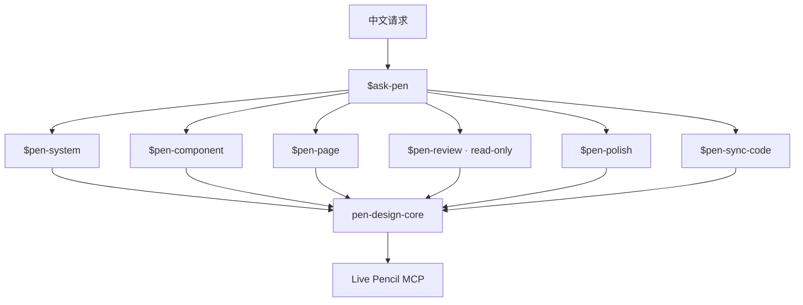

# Pen Design Skills

一套面向 **Pen / pen.dev、`.pen` 文件与 Pencil MCP** 的 Agent Skill 命令组。它把设计工作拆成设计标准、组件、页面、只读审查、质感打磨和设计—代码同步六类命令，并通过共享核心统一执行：

```text
读取现场 → 查清事实 → 只询问设计决策 → 建立设计契约
→ 小批写入 → 独立回读 → 聚焦截图 → 证据化交付
```

文档和提示词默认使用中文；Skill 名、MCP/API、属性和代码标识保留英文。

## 为什么不是一个大 Skill

不同设计任务拥有不同的权限和完成条件：

- Review 必须严格只读；
- Component 应修改组件 source，并检查代表性 instance；
- Page 应复用现有系统，而不是从 primitives 重建；
- Polish 应保留内容、结构和行为，只处理一个主要质量问题；
- Sync 每个阶段只能写一个 target side；
- System 才负责 variables、themes 和全局组件政策。

拆成命令后，用户可以清楚表达授权，Agent 也更难把局部任务扩张为开放式 redesign。

## 架构



`ask-pen` 是显式 router；六个业务命令拥有各自边界；`pen-design-core` 保存共享的 discovery、访谈、复用、执行恢复、质量证据和 Design ↔ Code reconciliation。

## 包含的 Skills

| 命令 | 适用任务 | 写入边界 | 典型完成条件 |
| --- | --- | --- | --- |
| `$ask-pen` | 不确定该用哪个命令 | 不写设计 | 选定一个命令并说明原因、输入和边界 |
| `$pen-system` | 新建或演进 variables、themes、组件政策和设计标准 | 已确认的 system foundations | foundations 有权威来源、映射和核验证据 |
| `$pen-component` | 构建或修复可复用组件/组件族 | 目标 component source 与代表实例 | states、bindings、instance 和截图一致 |
| `$pen-page` | 组装页面、流程、响应式和产品状态 | 目标页面/流程 | 复用既有资产，结构、状态和视觉均核验 |
| `$pen-review` | 结构、复用、响应式、可访问性和视觉体检 | **严格只读** | 发现带 evidence、owner 和 acceptance check |
| `$pen-polish` | 减少 AI 模板感、改善层级和质感 | 已确认页面中的单一质量杠杆 | before/after 同 scope，结构与行为保持 |
| `$pen-sync-code` | Design → Code、Code → Design、token-only | 每阶段只写一个 target side | mapping 分类完成，另一侧保持不变 |
| `pen-design-core` | 共享运行时 | 由调用命令决定 | 每批有 readback/checkpoint，无未解释 partial state |

## 前置条件

1. 支持 Agent Skills 的 Codex 环境；
2. Pen/pen.dev 桌面应用或兼容的 Pencil MCP；
3. 目标 `.pen` 文件已在编辑器中打开；
4. MCP 至少提供当前版本对应的 editor state、读取、写入和 screenshot 能力。

工具名称和 schema 会演进。Skill 会先读取当前会话实际暴露的工具，并以 **live schema** 为准；README 或社区仓库里的示例工具名都不是长期 API contract。

## 安装

### 一行安装到项目（推荐）

在目标项目目录中运行：

```bash
npx skills@latest add andyzhshg/pen-design-skills
```

[`skills`](https://github.com/vercel-labs/skills) CLI 会从本仓库发现全部 8 个 Skill，自动识别 Codex，并安装到当前项目的 `.agents/skills/`；同时生成 `skills-lock.json`，用于记录安装来源。项目级安装可以让 Skill 同时读取代码、tokens、组件 API、`AGENTS.md` 和项目设计文档。

安装前只查看可用 Skill：

```bash
npx skills@latest add andyzhshg/pen-design-skills --list
```

需要在所有项目中使用时，可以安装到个人环境：

```bash
npx skills@latest add andyzhshg/pen-design-skills --global
```

推荐安装完整套件。`ask-pen` 和六个业务命令都会委派给 `pen-design-core`；如果选择性安装某个业务命令，必须同时安装 `pen-design-core`。安装完成后新开一个 Codex 任务，让 Skill 列表重新加载。

### 严格不覆盖安装

仓库自带的 Python 安装器适合希望先 dry-run，并在发现任意同名目录时整体停止的场景：

```bash
git clone git@github.com:andyzhshg/pen-design-skills.git
cd pen-design-skills

# 先预览；不会写入
python3 scripts/install.py --dest /path/to/project/.agents/skills

# 确认没有冲突后再安装
python3 scripts/install.py --dest /path/to/project/.agents/skills --apply
```

安装器一次复制 manifest 中的全部 8 个 Skill。只要目标存在任意同名目录，就会在复制前整体停止；不会 merge、overwrite 或 delete。

安装到个人 Codex Skills 时，改用个人目录作为目标：

```bash
python3 scripts/install.py --dest "${CODEX_HOME:-$HOME/.codex}/skills"
python3 scripts/install.py --dest "${CODEX_HOME:-$HOME/.codex}/skills" --apply
```

个人安装适合跨项目使用；项目事实仍在每次执行时从当前仓库读取，不会缓存到 Skill 中。安装后新开一个 Codex 任务，让 Skill 列表重新加载。

### 更新

使用 `npx skills` 安装时，可以重新运行同一条 `add` 命令获取仓库的新版本，并在应用前检查 CLI 展示的变更。Python 安装器刻意拒绝覆盖；使用这种方式更新时，应先 review 新版本，再由你明确移走或删除旧的 8 个目录，然后重新运行 dry-run 与 `--apply`。仓库不会替你删除现有 Skill。

## 快速开始

不知道选哪个命令时，只需记住：

```text
$ask-pen 我想改善当前产品的 Pen 设计，帮我选择正确命令。
```

如果已经知道任务类型，直接使用显式命令：

```text
$pen-review 只读检查当前结算页，重点看组件复用、响应式和视觉层级。

$pen-system 为当前项目整理支持 Dark / Light 的设计标准。
先读取 Pen 与代码 tokens，不要覆盖已有 foundations，所有问题给推荐项。

$pen-component 为现有系统补一个上传按钮组件。
覆盖默认、上传中、成功、失败和禁用状态，先检查已有 Button。

$pen-page 使用现有导航和组件组装账号安全页。
覆盖桌面、手机、loading、empty 和 error，全部按推荐方案提问。

$pen-polish 保留信息结构、真实内容和交互，
让当前仪表盘减少 AI 模板感；先用证据诊断一个首要问题。

$pen-sync-code 把代码 tokens 同步到 Pen，只做 token-only。
代码是权威来源，不修改代码。
```

中文调用不会降低触发可靠性。建议保留 `$command` 英文标识，把要求、内容和设计判断写成中文。

## Agent 会怎样提问

Skill 不会一开始抛出一张固定问卷。它先从 Pen 和项目环境查明：

- 当前文件、selection 和目标子树；
- variables、themes、components、instances 与 imports；
- 代码 tokens、组件 API、states 和 breakpoints；
- 已有设计文档与项目约定。

只把无法从环境确定的内容组织成 **design frontier**，例如：

- 这个页面的 primary action 是什么？
- 需要支持哪些主题、viewport 和产品状态？
- 哪一侧是 token 或 behavior 的权威？
- 应保留什么结构、内容和交互？
- 视觉方向选择哪一种？

每题会给出推荐项。你可以回答“全部按推荐”，Agent 会重新计算剩余 frontier；事实问题仍由 Agent 自己调查。

## 共享工作流

所有写入命令遵守同一条循环。

### 1. Preflight

确认 live Pencil MCP、活动文件、selection、目标项目和授权范围。缺少文件或工具时报告准确 blocker，不虚构截图、诊断或执行结果。

### 2. Discovery

读取覆盖目标的最小子树，再按需检查 variables、themes、components、instances、imports 和代码侧事实。关键结论保留来源。

### 3. Interview 与 Design Contract

只询问未解决的设计决策，汇总 goal、target、preserve invariants、source-of-truth、reuse decision、write scope 和 acceptance evidence。

### 4. Execute

使用 live MCP 的实际 API 小批修改。每批都有 precondition、postcondition 和 checkpoint：

```text
Observe → Plan → Mutate → Read back → Checkpoint
```

### 5. Verify

按 cheap-first evidence ladder 核验：

```text
Structure → Layout → System → Product → Visual → Comparison
```

object tree 能回答的问题不靠截图猜；截图必须对应本轮真实 image artifact 和明确 target。

### 6. Recover

工具失败或结果不明确时，先读回目标并分类：

```text
applied / missing / unexpected
```

只修补 missing/unexpected。没有证据证明零副作用时，不重放 create、insert、duplicate 或整个 mutation batch。

## 复用策略

创建组件或页面前依次检查：

1. 当前项目 local variables/components；
2. 已采用的 imported design library；
3. 代码侧 component/token counterpart；
4. 新建资产。

然后选择：

- **Reuse**：语义、结构/API、states 和 token 模型兼容；
- **Repair**：它本来就是同一资产，修复 source；
- **Wrap / Extend**：复用基础语义，通过 slot 或 composition 表达差异；
- **Create**：没有兼容候选，并记录不复用的原因。

视觉相似不等于 API 兼容。一次性页面结构也不需要为了“整齐”全部组件化。

## Design ↔ Code 同步

`$pen-sync-code` 支持三种 profile：

- **Design → Code**
- **Code → Design**
- **Token-only**

同步前逐项建立 mapping：

```text
semantic role
→ Pen source
→ code source
→ authority
→ transform
→ exact / mapped / intentional divergence / unsupported / conflict
→ target write
→ verification
```

同一阶段只写一个 target side。需要双向改动时拆成两个阶段，并分别授权、验证；同步命令不会顺手做开放式 redesign。

## 权限与安全边界

- `$pen-review` 不修改 Pen、代码或设计文档；
- `$pen-polish` 只修改已确认的主要质量杠杆；
- `$pen-sync-code` 每阶段只写一个 target side；
- 写入 `.pen` 使用 Pencil MCP/Editor，不直接改序列化文件；
- 现有 token、component 和 import 在覆盖前必须先盘点；
- 未确认的 project inventory、node ID 和 token value 不写进 Skill；
- screenshot 没有真实 artifact 时明确报告 `Screenshot: not captured`；
- 需要磁盘证据时先确认编辑器已经安全保存。

## 项目适配

Skill 保存决策方法，项目保存项目事实。推荐在实际项目中维护：

- `AGENTS.md` / `CLAUDE.md`；
- token/theme 配置；
- component API 与 examples；
- 产品 states、responsive 和 accessibility 约定；
- 设计文档或 design contract。

如果 Pen 与代码冲突，不要把某一侧整体宣布为唯一真值。应按 tokens、components、content/behavior、visual direction 和 responsive/states 分别确认 authority。

## 验证

运行仓库级静态检查：

```bash
python3 scripts/validate.py
```

验证内容包括：

- 8 个 Skill 的 frontmatter 与 UI metadata；
- 显式命令与隐式 core 的 invocation policy；
- 6 份共享 references 和指针；
- command dependency；
- Review 只读边界；
- 6 个中文行为 eval cases；
- installer 与核心 audit script。

验证安装器：

```bash
tmp_dir="$(mktemp -d)"
python3 scripts/install.py --dest "$tmp_dir/skills"
python3 scripts/install.py --dest "$tmp_dir/skills" --apply
python3 scripts/install.py --dest "$tmp_dir/skills" --apply  # 预期因冲突失败
```

行为用例见 [evals/pen-command-suite.json](evals/pen-command-suite.json)，隔离测试流程见 [evals/forward-test-protocol.md](evals/forward-test-protocol.md)。

### 已验证范围

- 8 Skill / 6 references / 6 Chinese eval cases 静态验证；
- fresh-agent offline blind tests：路由、权限、阻塞和恢复决策；
- live Pencil MCP：真实写入、独立 readback、截图、原子回滚与 `editId` repair；
- Review baseline/after 零写入；
- reusable component source + instance override；
- 保存、关闭、重开后的 IDs、refs 与 bindings；
- Code → Pen token-only 单侧同步。

### 尚未覆盖

- 完整 `$pen-page` 和 `$pen-polish` live case；
- 多人并发编辑；
- 网络超时造成的 ambiguous partial state；
- 跨文件 imports；
- 大型真实项目性能。

不要把静态 validator 通过解释为所有 live 场景都已证明。

## 常见问题

### Agent 说没有 Pencil MCP

确认 Pen 已运行，并在编辑器中打开目标 `.pen` 文件。新任务中重新检查工具列表；不要让 Agent 根据磁盘 snapshot 猜测 editor memory。

### Agent 一上来问很多事实问题

提醒它先执行 Discovery：项目内能查到的 variables、components、tokens、breakpoints 和代码 API 应由 Agent 查明。用户只决定 design frontier。

### 修改后脚本看不到结果

MCP 可能观察 editor memory，而外部脚本读取磁盘。先取消 selection，安全保存，再运行磁盘脚本。

### MCP 调用失败后想重新执行整批

要求先 readback，并报告 `applied / missing / unexpected`。如果工具返回 repair/edit ID，使用同一 ID 做最小修补。

### Review 开始自动修改

立即停止。重新显式调用：

```text
$pen-review 只读检查，不修复，不修改 Pen、代码或设计文档。
```

需要修复时另开一个已授权命令，如 `$pen-component`、`$pen-polish` 或 `$pen-system`。

## 仓库结构

```text
.
├── README.md
├── manifest.json
├── skills/
│   ├── ask-pen/
│   ├── pen-system/
│   ├── pen-component/
│   ├── pen-page/
│   ├── pen-review/
│   ├── pen-polish/
│   ├── pen-sync-code/
│   └── pen-design-core/
│       ├── references/
│       └── scripts/
├── scripts/
│   ├── install.py
│   └── validate.py
└── evals/
    ├── pen-command-suite.json
    └── forward-test-protocol.md
```

## 开发与贡献

修改套件时：

1. 保持 command-specific write boundary；
2. 共享流程只在 `pen-design-core` 维护，避免复制到六个命令；
3. project inventory 从运行环境读取，不缓存到 Skill；
4. 更新 `manifest.json` 与对应中文 eval；
5. 运行 `python3 scripts/validate.py`；
6. 在临时目录执行 installer dry-run 与 apply；
7. 复杂变更使用全新 Agent context 做 blind forward test。

## 致谢

工作流设计参考了 [Nisus74/pencil-skill](https://github.com/Nisus74/pencil-skill) 的组件优先、骨架优先、小批修改与视觉复盘思路。具体 MCP 调用没有照抄；本仓库始终以当前会话的 live Pencil schema 为准。
